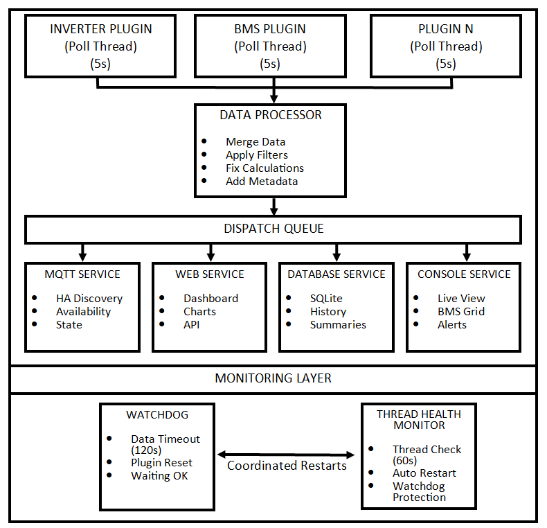

# Developer Guide

This guide covers plugin development, system architecture, and contributing to the Solar Monitoring Framework.

## Table of Contents

- [Architecture Overview](#architecture-overview)
- [Plugin Development](#plugin-development)
- [Design References](#design-references)
- [Development Workflow](#development-workflow)
- [Testing Your Plugin](#testing-your-plugin)
- [Code Standards](#code-standards)
- [Contributing Guidelines](#contributing-guidelines)

## Architecture Overview

The Solar Monitoring Framework uses a robust, multi-threaded architecture designed for reliability and extensibility:

### 🏗️ System Architecture



### 🔄 Key Features

- **🧵 Multi-threaded**: Each device polled independently (5s intervals)
- **🔄 Data Processing**: Central processor merges, filters, enriches data, and runs multi-BMS aggregation
- **📤 Real-time Distribution**: Simultaneous updates to all services
- **🛡️ Self-healing**: 3-layer monitoring with automatic recovery
- **✅ Startup validation**: Config schema + plugin metadata logged on load
- **🏠 HA Integration**: MQTT auto-discovery with availability tracking
- **📈 Ops**: Optional Prometheus `/metrics`, SQLite vacuum/retention
- **📊 Rich Interfaces**: Web dashboard (density + health + FW badges), console UI (`FONT_SCALE`), database logging
- **🔌 Extensible**: Plugin architecture with `PLUGIN_META` for capability discovery

### 🛡️ Monitoring System

| Layer | Purpose | Timeout | Action |
|-------|---------|---------|--------|
| **Watchdog** | Data responsiveness | 120s | Plugin restart |
| **Thread Monitor** | Thread lifecycle | 60s | Thread recreation |
| **MQTT Availability** | HA integration | 15min | Availability status |
| **Plugin health keys** | UI / Prometheus | per cycle | Expose age + failures |

### 📊 Data Flow

1. **Plugins** → Poll devices every 5s (sanitized packets)
2. **Processor** → Merge, **BMS aggregate**, filter, enrich (`*_health_*` keys)
3. **Services** → Web, console, MQTT, database, optional Prometheus
4. **Monitoring** → Ensure all components stay healthy

## Plugin Development

### 🧩 Plugin Interface

All plugins must inherit from `DevicePlugin` and implement the required abstract methods:

```python
from plugins.plugin_interface import DevicePlugin, StandardDataKeys

class MyNewPlugin(DevicePlugin):
    PLUGIN_META = {
        "plugin_id": "my_new_plugin",
        "category": "inverter",  # or "bms"
        "protocols": ["modbus_tcp", "modbus_rtu"],
        "models": ["ModelA"],
        "status": "testing",  # stable | testing | experimental
        "api_version": 1,
    }

    def __init__(self, instance_name, plugin_specific_config, main_logger, app_state):
        super().__init__(instance_name, plugin_specific_config, main_logger, app_state)
        # Your initialization logic here
    
    @property
    def name(self) -> str:
        return "my_new_plugin"
    
    @property
    def pretty_name(self) -> str:
        return "My New Device Plugin"
    
    def connect(self) -> bool:
        # Connection logic
        pass
    
    def disconnect(self) -> None:
        # Disconnection logic
        pass
    
    def read_static_data(self) -> Optional[Dict[str, Any]]:
        # Read device info (model, serial, etc.)
        pass
    
    def read_dynamic_data(self) -> Optional[Dict[str, Any]]:
        # Read operational data
        pass
```

`DevicePlugin.get_plugin_meta()` returns `PLUGIN_META` (or a safe default). On load, `plugin_manager` stores it at `plugin.plugin_config["_plugin_meta"]` and logs it.

### Modbus plugins

Prefer [`plugins/modbus_helper.py`](plugins/modbus_helper.py) for client creation and `unit=`/`slave=`-compatible reads (`create_modbus_client`, `safe_read_holding` / `safe_read_input`, `decode_registers`). Solis is the reference migration; other Modbus plugins should converge on the same helper for pymodbus compatibility.

### Multi-BMS note

BMS plugins should publish SOC, voltage, current, power, and capacity Ah keys when available. The aggregator (`core/bms_aggregator.py`) combines all instances with `_runtime_device_category == "bms"` using capacity-weighted SOC. Do not invent a separate “combined SOC” key for the main tile — write standard battery keys; the processor overwrites them with the aggregate when multiple packs exist.

### 📋 Required Methods

#### `connect(self) -> bool`
- Establish connection to the device
- **Must** set `self._is_connected_flag = True` on success
- Return `True` on success, `False` on failure
- Handle connection errors gracefully

#### `disconnect(self) -> None`
- Clean up connection resources
- **Must** set `self._is_connected_flag = False`
- Handle disconnection errors gracefully

#### `read_static_data(self) -> Optional[Dict[str, Any]]`
- Read permanent device information
- **Must** include `StandardDataKeys.STATIC_DEVICE_CATEGORY`
- Return dictionary with StandardDataKeys as keys
- Cache results for efficiency

#### `read_dynamic_data(self) -> Optional[Dict[str, Any]]`
- Read real-time operational data
- Return dictionary with StandardDataKeys as keys
- Handle communication errors gracefully

### 🔑 StandardDataKeys

Use standardized keys for data consistency:

```python
# Static data keys
StandardDataKeys.STATIC_DEVICE_CATEGORY  # "inverter", "bms", etc.
StandardDataKeys.STATIC_INVERTER_MODEL_NAME
StandardDataKeys.STATIC_INVERTER_SERIAL_NUMBER
StandardDataKeys.STATIC_INVERTER_FIRMWARE_VERSION

# Dynamic data keys
StandardDataKeys.OPERATIONAL_INVERTER_STATUS_TEXT
StandardDataKeys.BATTERY_STATE_OF_CHARGE_PERCENT
StandardDataKeys.PV_TOTAL_DC_POWER_WATTS
StandardDataKeys.GRID_TOTAL_ACTIVE_POWER_WATTS
StandardDataKeys.BATTERY_POWER_WATTS
```

### 🏗️ Plugin Structure

```
plugins/
├── inverter/
│   ├── my_new_inverter_plugin.py
│   ├── my_new_inverter_constants.py
│   └── __init__.py
├── battery/
│   ├── my_new_bms_plugin.py
│   ├── my_new_bms_constants.py
│   └── __init__.py
└── plugin_interface.py
```

## Design References

The framework provides comprehensive design references based on proven, stable plugin architectures:

### 📖 Available References

- **[Inverter Plugin Design Reference](INVERTER_PLUGIN_DESIGN_REFERENCE.md)** - Based on the stable Solis plugin
- **[BMS Plugin Design Reference](BMS_PLUGIN_DESIGN_REFERENCE.md)** - Based on the stable Seplos V2 plugin

### 🎯 Key Design Principles

1. **Consistency**: Follow established patterns from stable plugins
2. **Error Handling**: Comprehensive exception handling and logging
3. **Connection Management**: Robust connection lifecycle management
4. **Data Validation**: Type checking and data sanitization (`core/data_sanitizer.py`)
5. **Documentation**: Complete docstrings and code comments
6. **Capability Metadata**: Declare `PLUGIN_META` (id, category, protocols, models, status)
7. **Config Discoverability**: Implement `get_configurable_params()` so the validator and docs stay accurate

## Development Workflow

### 1. 📋 Planning Phase

1. **Choose Plugin Type**: Inverter, BMS, or other device category
2. **Study Protocol**: Understand device communication protocol
3. **Review Design Reference**: Follow established patterns
4. **Plan Data Mapping**: Map device data to StandardDataKeys

### 2. 🔧 Implementation Phase

1. **Create Plugin Files**:
   ```bash
   plugins/inverter/my_device_plugin.py
   plugins/inverter/my_device_constants.py
   ```

2. **Implement Core Methods**:
   - `__init__()` - Initialize with configuration
   - `connect()` - Establish device connection
   - `disconnect()` - Clean up resources
   - `read_static_data()` - Device information
   - `read_dynamic_data()` - Operational data

3. **Create Constants File**:
   ```python
   # Register definitions, status codes, etc.
   DEVICE_REGISTERS = {
       "voltage": {"addr": 0x1000, "type": "uint16", "scale": 0.1, "unit": "V"},
       "current": {"addr": 0x1001, "type": "int16", "scale": 0.01, "unit": "A"},
   }
   ```

### 3. 🧪 Testing Phase

1. **Create Test Script**:
   ```bash
   test_plugins/my_device_stand_alone_test.py
   ```

2. **Test Plugin Loading**:
   ```bash
   python test_plugins/quick_plugin_check.py
   ```

3. **Test with Hardware**:
   ```bash
   python test_plugins/my_device_stand_alone_test.py
   ```

4. **Comprehensive Validation**:
   ```bash
   python test_plugins/validate_all_plugins.py
   ```

5. **Offline Capture / HA Regression** (no hardware):
   ```bash
   python -m unittest test_plugins.test_capture_replay -v
   python -m unittest test_plugins.test_ha_discovery_coverage -v
   python -m unittest test_plugins.test_data_sanitizer_and_jk_decoder -v
   ```

### 4. 📝 Documentation Phase

1. **Update Plugin Registry**: Add to validation tools
2. **Create Configuration Examples**: Add to config.ini.example
3. **Update Documentation**: Add to README.md and relevant guides
4. **Write Tests**: Ensure comprehensive test coverage

## Testing Your Plugin

### 🔍 Validation Levels

1. **Quick Check**: Verify plugin loads correctly
2. **Offline Validation**: Test without hardware
3. **Hardware Testing**: Test with actual device
4. **Integration Testing**: Test in full application

### 🧪 Testing Commands

```bash
# Quick plugin loading test
python test_plugins/quick_plugin_check.py

# Comprehensive validation
python test_plugins/validate_all_plugins.py --offline-only

# Individual plugin test
python test_plugins/my_device_stand_alone_test.py

# Full system integration
python main.py
```

### 📊 Test Coverage

Ensure your plugin passes all validation tests:
- ✅ Plugin loading and instantiation
- ✅ Interface compliance
- ✅ Configuration parsing
- ✅ Connection establishment
- ✅ Data reading and validation
- ✅ Error handling
- ✅ Clean disconnection

## Code Standards

### 🎨 Coding Style

Follow the established patterns from stable plugins:

1. **Imports**: Organize imports logically
2. **Type Hints**: Use comprehensive type annotations
3. **Docstrings**: Document all classes and methods
4. **Error Handling**: Use specific exception types
5. **Logging**: Consistent logging format

### 📝 Documentation Standards

```python
def read_dynamic_data(self) -> Optional[Dict[str, Any]]:
    """
    Reads dynamic/operational data from the device.
    
    Returns:
        A dictionary containing the standardized dynamic data, or None if the read fails.
        
    Raises:
        ConnectionError: If device communication fails
        ValueError: If data validation fails
    """
```

### 🛡️ Error Handling

```python
try:
    result = self.device.read_data()
    return self._process_data(result)
except ConnectionError as e:
    self.logger.error(f"Connection failed: {e}")
    self.disconnect()
    return None
except Exception as e:
    self.logger.error(f"Unexpected error: {e}", exc_info=True)
    return None
```

### 🔧 Configuration Handling

```python
def __init__(self, instance_name, plugin_specific_config, main_logger, app_state):
    super().__init__(instance_name, plugin_specific_config, main_logger, app_state)
    
    # Parse configuration with defaults
    self.host = self.plugin_config.get("host", "192.168.1.100")
    self.port = int(self.plugin_config.get("port", 502))
    self.timeout = int(self.plugin_config.get("timeout", 10))
    
    # Validate configuration
    if not self.host:
        raise ValueError("Host configuration is required")
```

## Contributing Guidelines

### 🤝 How to Contribute

1. **Fork the Repository**
2. **Create Feature Branch**: `git checkout -b feature/my-new-plugin`
3. **Implement Plugin**: Follow development workflow
4. **Test Thoroughly**: Ensure all validation tests pass
5. **Update Documentation**: Add configuration examples and documentation
6. **Submit Pull Request**: Include detailed description and test results

### 📋 Pull Request Checklist

- [ ] Plugin follows established design patterns
- [ ] All validation tests pass
- [ ] Configuration examples added
- [ ] Documentation updated
- [ ] Test script created
- [ ] Error handling implemented
- [ ] Logging follows standards
- [ ] Code is well-documented

### 🧪 Testing Requirements

Before submitting a pull request:

1. **Plugin Validation**: All validation tools must pass
2. **Hardware Testing**: Test with actual device if possible
3. **Integration Testing**: Test in full application
4. **Documentation**: Ensure examples work correctly

### 📝 Code Review Process

1. **Automated Checks**: CI/CD pipeline validates plugin
2. **Manual Review**: Code review by maintainers
3. **Testing**: Community testing with hardware
4. **Documentation Review**: Ensure documentation is complete
5. **Merge**: Integration into main branch

### 🏷️ Plugin Status Progression

1. **🧪 Needs Testers**: Initial implementation, requires community validation
2. **⚠️ Ready for Testing**: Complete implementation, ready for user testing
3. **✅ Stable**: Proven in production use with community feedback

## Advanced Topics

### 🔄 Connection Management

For robust connection handling:

```python
def connect(self) -> bool:
    if self._is_connected_flag and self.client:
        return True
    
    if self.client:
        self.disconnect()
    
    try:
        # Pre-connection validation
        if not self._validate_connection_params():
            return False
        
        # Establish connection
        self.client = self._create_client()
        if self.client.connect():
            self._is_connected_flag = True
            return True
        else:
            self._handle_connection_failure()
            return False
            
    except Exception as e:
        self.logger.error(f"Connection error: {e}")
        self.disconnect()
        return False
```

### 📊 Data Processing

For consistent data processing:

```python
def _standardize_data(self, raw_data: Dict[str, Any]) -> Dict[str, Any]:
    """Convert raw device data to standardized format."""
    standardized = {}
    
    # Map device-specific data to StandardDataKeys
    if "device_voltage" in raw_data:
        standardized[StandardDataKeys.BATTERY_VOLTAGE_VOLTS] = raw_data["device_voltage"]
    
    if "device_current" in raw_data:
        standardized[StandardDataKeys.BATTERY_CURRENT_AMPS] = raw_data["device_current"]
    
    # Calculate derived values
    if "voltage" in raw_data and "current" in raw_data:
        power = raw_data["voltage"] * raw_data["current"]
        standardized[StandardDataKeys.BATTERY_POWER_WATTS] = power
    
    return standardized
```

### 🔧 Configuration Validation

For robust configuration handling:

```python
def _validate_configuration(self) -> bool:
    """Validate plugin configuration parameters."""
    required_params = ["host", "port"]
    
    for param in required_params:
        if param not in self.plugin_config:
            self.logger.error(f"Required parameter '{param}' missing")
            return False
    
    # Validate parameter types and ranges
    try:
        port = int(self.plugin_config["port"])
        if not (1 <= port <= 65535):
            raise ValueError("Port must be between 1 and 65535")
    except (ValueError, TypeError) as e:
        self.logger.error(f"Invalid port configuration: {e}")
        return False
    
    return True
```

## Resources

### 📚 Documentation
- [Plugin Interface Reference](plugins/plugin_interface.py)
- [StandardDataKeys Documentation](plugins/plugin_interface.py)
- [Testing Guide](TESTING.md)
- [Configuration Guide](CONFIGURATION.md)

### 🔧 Tools
- [Plugin Validation Tools](test_plugins/)
- [Individual Test Scripts](test_plugins/)
- [Configuration Examples](config.ini.example)

### 🤝 Community
- [GitHub Issues](https://github.com/jcvsite/solar-monitoring/issues)
- [Discussions](https://github.com/jcvsite/solar-monitoring/discussions)
- [Contributing Guidelines](CONTRIBUTING.md)

## Getting Help

If you need help with plugin development:

1. **Check Documentation**: Review design references and examples
2. **Study Existing Plugins**: Look at stable plugin implementations
3. **Use Validation Tools**: Test your plugin thoroughly
4. **Ask Questions**: Open GitHub discussions or issues
5. **Join Community**: Connect with other developers

Remember: The goal is to create reliable, well-tested plugins that provide value to the community. Take time to follow established patterns and test thoroughly!
