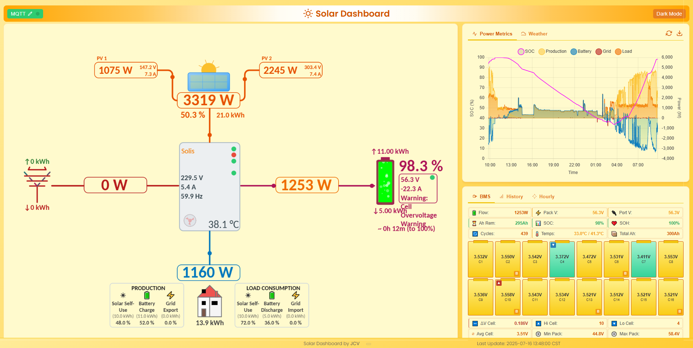
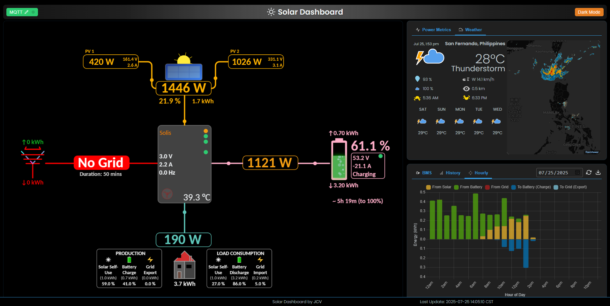
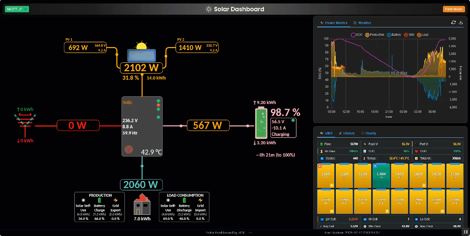
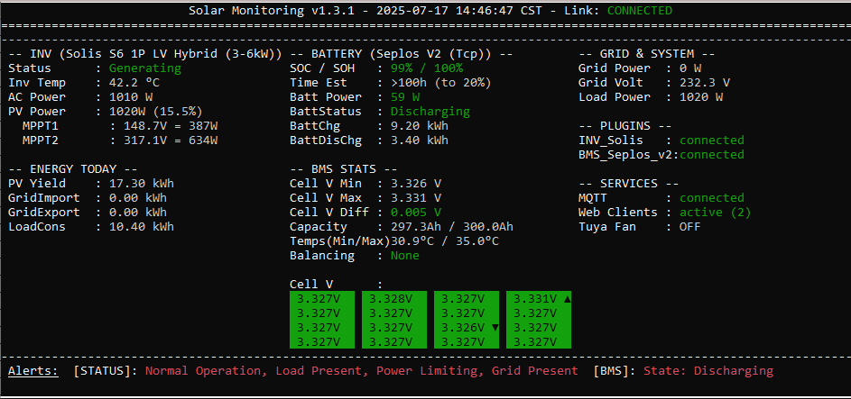
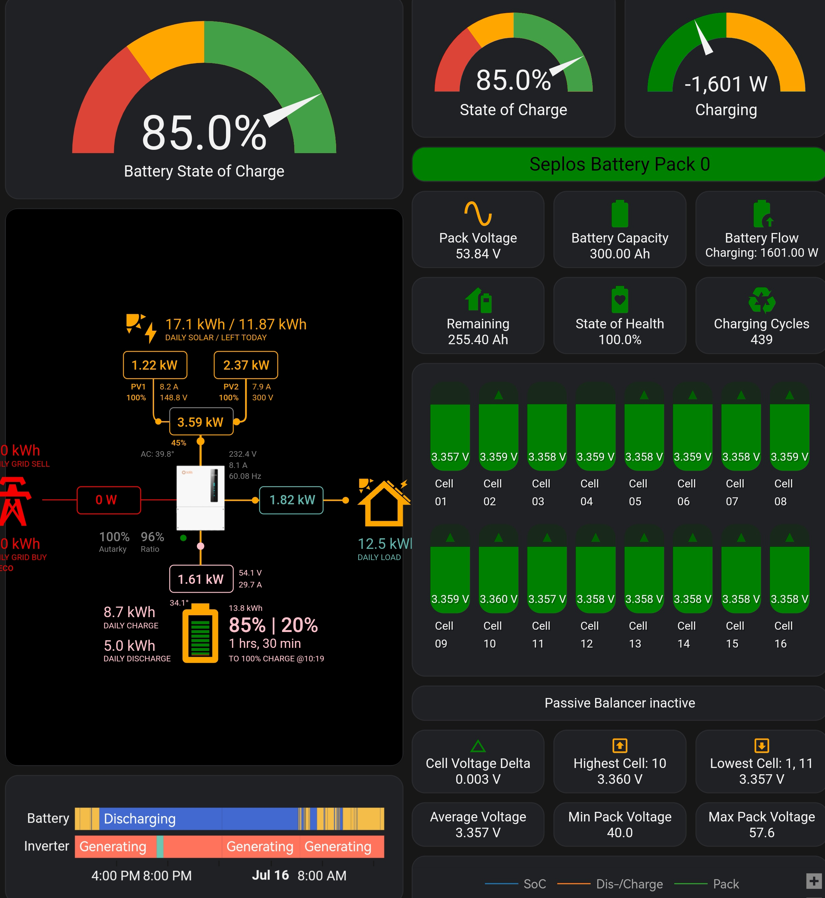
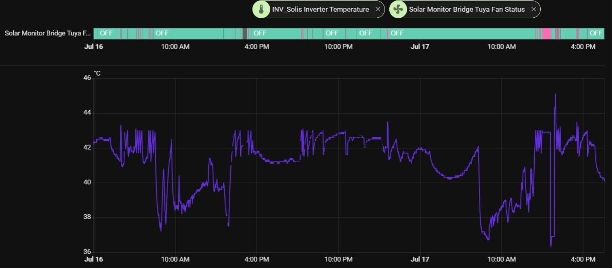
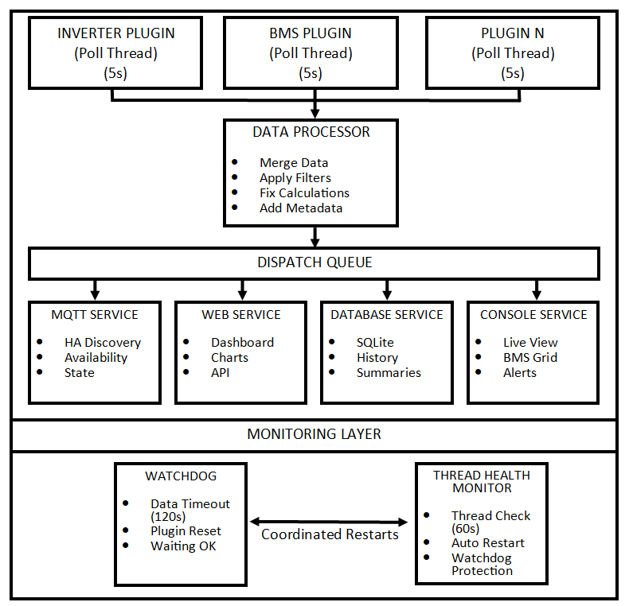

# Solar Monitoring Framework

[](https://opensource.org/licenses/MIT)
[](https://www.python.org/downloads/)
[](https://github.com/psf/black)

A comprehensive, plugin-driven, multi-threaded Python framework for monitoring renewable energy systems. It fetches data from various devices (inverters, BMS) via configurable plugins, aggregates the data, and provides a rich set of features for real-time monitoring, historical analysis, and home automation integration.

## ⚡ **True Real-Time Monitoring**

**Unlike manufacturer apps that update every 15+ minutes, this framework provides genuine real-time data updates every 5 seconds!**

- 🚀 **5-second polling intervals** - See your solar production changes instantly
- 📱 **Manufacturer apps**: Typically 15-30 minute delays via cloud services
- 🌐 **Direct local connection** - No cloud delays or dependencies
- ⚡ **Instant response** - Watch power flows change in real-time as clouds pass or loads switch on/off
- 🎯 **Perfect for troubleshooting** - Immediately see the impact of system changes

*Stop waiting for stale data - monitor your solar system as it actually performs!*

## Core Features

-   **🧩 Plugin-Based Architecture:** Easily extendable to support new devices by creating new plugins. The framework handles the core logic of polling, data processing, and service integration.
-   **📡 Multi-Device Support:** Concurrently poll multiple devices (e.g., an inverter and a separate BMS) each in its own managed thread.
-   **📊 Data Aggregation:** A central data processor intelligently merges data from all plugins into a unified system view.
-   **🛡️ Intelligent Data Filtering:** Advanced time-based filtering system that automatically detects and prevents sensor errors, unit conversion issues, and communication glitches from corrupting your data.
-   **🌡 Fan Automation:** Local Tuya device control for temperature-based fan automation and other smart home integrations.
-   **🌐 Offline-First Design:** Full functionality without internet connection - only weather data requires online access.
-   **🏠 Home Automation Integration:** Optional MQTT integration with Home Assistant, OpenHAB, Domoticz, Node-RED, and other platforms.
-   **🌐 Dynamic Web Dashboard:** A powerful web interface providing a holistic view of your system.
-   **📅 Historical Data Logging:** Records detailed power flow and daily energy summaries to a local SQLite database for advanced analytics and chart generation.
-   **🛡️ System Stability:** A built-in watchdog monitors plugin threads, automatically attempting to re-initialize a failing plugin and triggering a full script restart if necessary.

## Offline Operation

**🌐 Works Without Internet Connection**

The Solar Monitoring Framework is designed to operate completely offline, making it perfect for remote installations or areas with unreliable internet connectivity:

### **✅ Fully Offline Features:**
-   **📊 Data Collection:** All device polling (inverters, BMS) via Modbus TCP/Serial
-   **🔌 Smart Automation:** Tuya device control using local network communication
-   **🌐 Web Dashboard:** Complete web interface with real-time updates
-   **💻 Console Dashboard:** Text-based monitoring interface
-   **💾 Data Logging:** SQLite database storage and historical data
-   **📈 Charts & Analytics:** All dashboard charts and energy flow diagrams
-   **🛡️ Data Filtering:** Intelligent spike detection and data validation
-   **🏠 Local MQTT:** Home Assistant integration via local MQTT broker

### **🌐 Internet-Only Features:**
-   **🌦️ Weather Widget:** Current weather and radar maps (optional)
-   **🔄 Update Checks:** GitHub version checking (can be disabled)

### **🔌 Tuya Offline Automation:**
The framework includes sophisticated local Tuya device control that works entirely on your local network:
-   **Temperature-based fan control** using inverter temperature readings
-   **Local network communication** - no cloud dependency
-   **Automatic device discovery** or manual IP configuration
-   **Real-time status monitoring** and control feedback
-   **Integration with system alerts** for automated responses

**Perfect for:** Remote solar installations, off-grid systems, areas with poor internet connectivity, or users who prefer local-only operation for privacy and reliability.

## Dashboard Highlights

### 🌐 Web Dashboard

-   **⚡️ Live Energy Flow Diagram:** Animated visualization of power flow between all system components.
-   **📱 Responsive, Tabbed UI:** A clean interface that organizes data into logical tabs.
-   **📈 Advanced Analytics:**
    -   **Power Metrics:** Live-updating chart of key power flows.
    -   **BMS Viewer:** A detailed, self-contained view of Battery Management System data, including individual cell voltages.
    -   **History Chart:** Aggregated daily, monthly, and yearly energy summaries for long-term trend analysis.
    -   **Hourly Chart:** An in-depth hourly stacked bar chart, showing the flow of energy (consumption sources vs. grid/battery returns).
    -   **🌦️ Weather Widget:** Optional current weather and radar map integration.
-   **📥 Installable Web App (PWA):** Install the dashboard as a native-like app on your desktop or mobile device.
-   **📤 Data Export:** Export chart data directly to a `.csv` file.
-   **🌗 Light & Dark Themes:** Automatically adapts to your system preference and includes a manual toggle.

### 💻 Console Dashboard

-   **📊 Real-time Metrics:** A lightweight, text-based interface for at-a-glance monitoring of all key system values.
-   **🎨 Color-coded BMS View:** Instantly identify cell voltage imbalances with a color-coded grid view of all BMS cells.

## Available Plugins

This framework comes with the following built-in plugins. The status indicates the level of testing and community validation.

| Plugin | Description | Status |
| :--- | :--- | :--- |
| 🔌 **Inverters** | | |
| `inverter.solis_modbus_plugin` | For Ginlong/Solis S6 and similar hybrid inverters using Modbus TCP or Serial. | ✅ Stable |
| `inverter.deye_sunsynk` | For Deye and Sunsynk hybrid inverters using Modbus TCP. | 🧪 Needs Testers |
| 🔋 **Battery Management Systems (BMS)** | | |
| `battery.seplos_bms_v2` | For Seplos V2 BMS units using their proprietary serial or TCP protocol. | ✅ Stable |
| `battery.seplos_bms_v3` | For Seplos V3 BMS units using their proprietary serial or TCP protocol. | 🧪 Needs Testers |
| `battery.jk_bms_modbus` | For JK BMS units that support the RS485 Modbus protocol. | 🧪 Needs Testers |

*(To add a new plugin, see the Developer Guide section below)*

## Screenshots

*   **Web Dashboard:**
    
    
    _The main web interface showing key metrics and charts (Light and Dark modes)._

    
    _Live energy flow visualization between PV, Grid, Battery, and Load._

*   **Console Dashboard:**
    
    _The text-based console interface for quick monitoring._

*   **Home Assistant Integration:**
    
    _Example of data displayed in a Home Assistant dashboard via MQTT._

*   **Tuya Smart Plug Automation (Optional):**
    
    _Example graphs showing Tuya plug state and corresponding inverter temperature._


## System Requirements

**🔌 Minimal Hardware Requirements:**
*   **CPU:** Any x86/x64 processor (Intel Celeron, AMD equivalent, or better)
*   **ARM:** Raspberry Pi 3B+ or newer (Pi Zero 2W also supported)
*   **RAM:** 512MB minimum, 1GB recommended
*   **Storage:** 100MB for application + space for historical data (typically 10-50MB per year)
*   **Network:** Ethernet or WiFi for device communication (internet optional)

## Prerequisites

*   📦 **Ready-to-Run Package:** For a quick start on Windows, a pre-packaged version is available on the Releases page.
*   🐍 **Python:** For manual installation, Python 3.9 or newer is **required** (due to use of `zoneinfo`).
*   🔧 **System Libraries (for Optional Console UI):**
    *   **Linux/macOS:** `ncurses` development libraries (e.g., `sudo apt install libncursesw5-dev` on Debian/Ubuntu, `sudo yum install ncurses-devel` on Fedora/CentOS, or `brew install ncurses` on macOS).
    *   **Windows:** Requires the `windows-curses` package (see `requirements.txt`).
*   🔌 **Hardware & Services:**
    *   A solar inverter with Modbus communication enabled (check inverter settings and data logger capabilities).
    *   Optional: A compatible Battery BMS with a serial or TCP connection.
    *   **For Modbus TCP:** A network connection to the device (typically via its WiFi/Ethernet data logger module).
    *   **For Modbus Serial RTU:** An RS485-to-USB adapter connected to the device's RS485 port.
    *   **Optional:** An MQTT Broker for Home Assistant integration (e.g., Mosquitto, EMQX, or the Home Assistant Mosquitto broker add-on).
    *   **Optional:** A Tuya-based Smart Plug for fan control, and its **Device ID** & **Local Key**.
    *   A computer, Raspberry Pi, or similar device to run the script continuously.

**🏠 Home Automation Integration (Optional):**
*   **Standalone Operation:** The framework works completely independently - no external home automation platform required
*   **Home Assistant:** Full integration via MQTT with auto-discovery (optional MQTT broker required)
*   **Other Platforms:** Any MQTT-compatible home automation system (OpenHAB, Domoticz, Node-RED, etc.)
*   **All Core Features:** Web dashboard, data logging, device automation, and monitoring work without any external dependencies

## System Architecture

The Solar Monitoring Framework uses a robust, multi-threaded architecture designed for reliability and extensibility:

### 🏗️ Architecture Overview



### 🔄 Key Features

- **🧵 Multi-threaded**: Each device polled independently (5s intervals)
- **🔄 Data Processing**: Central processor merges, filters, and enriches data
- **📤 Real-time Distribution**: Simultaneous updates to all services
- **🛡️ Self-healing**: 3-layer monitoring with automatic recovery
- **🏠 HA Integration**: MQTT auto-discovery with availability tracking
- **📊 Rich Interfaces**: Web dashboard, console UI, database logging
- **🔌 Extensible**: Plugin architecture for new device types

### 🛡️ Monitoring System

| Layer | Purpose | Timeout | Action |
|-------|---------|---------|--------|
| **Watchdog** | Data responsiveness | 120s | Plugin restart |
| **Thread Monitor** | Thread lifecycle | 60s | Thread recreation |
| **MQTT Availability** | HA integration | 15min | Availability status |

### 📊 Data Flow

1. **Plugins** → Poll devices every 5s
2. **Processor** → Merge, filter, enrich data  
3. **Services** → Update dashboards, MQTT, database
4. **Monitoring** → Ensure all components stay healthy

This architecture ensures reliable, continuous monitoring with automatic recovery from failures while providing rich data to multiple interfaces.

## Installation


1.  **Clone the Repository:**
    ```bash
    git clone https://github.com/yourusername/solar-monitoring.git
    cd your-repository-name
    ```

2.  **Create a Python Virtual Environment (Recommended):**
    ```bash
    python3 -m venv venv
    source venv/bin/activate  # On Linux/macOS
    # venv\Scripts\activate    # On Windows
    ```

3.  **Install Dependencies:**
    ```bash
    pip install -r requirements.txt
    ```

4.  **Create and Edit Configuration File:**
    -   Copy the example: `cp config.ini.example config.ini`
    -   **Crucially, edit `config.ini`** to set up your specific hardware plugins and services.

## Running the Application

After activating your virtual environment (if used):
```bash
python main.py
```

**Running Continuously (Example: Windows Batch File for Auto-Restart)**

For simple auto-restart on Windows if the script crashes (though the internal watchdog aims to prevent hangs):

1.  **Create Batch File:** Create a text file named `start_solar_monitor.bat` in your script directory.
2.  **Edit Batch File:** Add these lines, **using the full paths** to your Python executable (if not in PATH or if using a venv) and the script:
    ```batch
    @echo off
    cd /d "C:\path\to\your\script\directory"
    :loop
    echo Starting Solar Monitoring...
    REM If using a virtual environment:
    REM C:\path\to\your\script\directory\venv\Scripts\python.exe main.py
    REM If Python is in PATH and no venv:
    python main.py
    echo Script exited with errorlevel %errorlevel%. Waiting 10 seconds before restart...
    timeout /t 10 /nobreak > nul
    goto loop
    ```
    *   You can create a shortcut to this `.bat` file and place it in the Windows Startup folder (`shell:startup`) to run the monitor automatically on boot.
    *   For more robust process management on Windows, consider tools like NSSM (Non-Sucking Service Manager).
    *   On Linux, using `systemd` is the recommended approach for a persistent service.

3.  **Keep it Running:** For continuous monitoring:
    *   **Linux:** Use `systemd` (recommended for reliability). Create a service file (e.g., `/etc/systemd/system/Solar-monitor.service`). See [example systemd service guides](https://tecadmin.net/create-systemd-service-file-in-linux/).
    *   **Docker:** Create a `Dockerfile` to containerize the application.
    *   **Terminal Multiplexers:** `screen` or `tmux` can keep the script running after you disconnect, but they are less robust than systemd/Docker for long-term services.
    *   **Windows:** Use the batch file method described above, or a tool like NSSM.

## Configuration (`config.ini`)

Edit the `config.ini` file. Key sections:

*   **`[GENERAL]`:**
    *   `PLUGIN_INSTANCES`: This is the most important setting. List the names of the plugin configurations you will create. For example:
    *   PLUGIN_INSTANCES = main_inverter, main_bms
    *   `LOCAL_TIMEZONE`: Your local IANA timezone name (e.g., `Asia/Manila`, `Europe/London`, `America/New_York`). Defaults to `UTC`. A list can be found [here](https://en.wikipedia.org/wiki/List_of_tz_database_time_zones).
    *   `CHECK_FOR_UPDATES`: `true` or `false` (default) to enable/disable checking GitHub for script updates on startup.
*   **`[INVERTER_SYSTEM]`:** These values define your physical system and are used for calculations and filtering.
    *   `DEFAULT_MPPT_COUNT`: Total number of MPPTs on your inverter.
    *   `PV_INSTALLED_CAPACITY_W`: Total peak DC power of your solar array in Watts.
    *   `INVERTER_MAX_AC_POWER_W`: Inverter's maximum continuous AC power output in Watts.
    *   `BATTERY_USABLE_CAPACITY_KWH`: Usable energy capacity of your battery bank in kWh (kilowatt-hours).
    *   `BATTERY_MAX_CHARGE_POWER_W`: Battery's maximum continuous charge power in Watts.
    *   `BATTERY_MAX_DISCHARGE_POWER_W`: Battery's maximum continuous discharge power in Watts.
*   **`Plugin Configuration`**
    *   For each name in PLUGIN_INSTANCES, you must create a corresponding [PLUGIN_...] section.
    *   Each plugin has its own specific connection settings (e.g., `tcp_host`, `serial_port`, `slave_address`). Refer to the example `config.ini` for the keys required by each plugin.
*   **`[MQTT]`:**
    *   `ENABLE_MQTT`: `true` to enable.
    *   `MQTT_HOST`, `MQTT_PORT`, `MQTT_USERNAME`, `MQTT_PASSWORD`: Broker details.
    *   `MQTT_TOPIC`: Base topic (e.g., `Solar`).
    *   `ENABLE_HA_DISCOVERY`: `true` for Home Assistant auto-discovery.
    *   `HA_DISCOVERY_PREFIX`: Usually `homeassistant`.
    *   `MQTT_STALE_DATA_TIMEOUT_SECONDS`: How long a plugin can be silent before being marked `offline` in MQTT (default `300`).
*   **`[TUYA]`:** (Optional Fan Control)
    *   Learn how to get Tuya local keys: search "tinytuya local key" or "tuya-cli wizard".
    *   `ENABLE_TUYA`: `true` to enable.
    *   `TUYA_DEVICE_ID`, `TUYA_LOCAL_KEY`, `TUYA_IP_ADDRESS` (can be `Auto`), `TUYA_VERSION` (e.g., `3.3`, `3.4`).
    *   `TEMP_THRESHOLD_ON`, `TEMP_THRESHOLD_OFF`: Inverter temperature (°C) for plug ON/OFF.
*   **`[WEB_DASHBOARD]`:**
    *   `ENABLE_WEB_DASHBOARD`: `true` to enable.
    *   `WEB_DASHBOARD_PORT`: Port for the web server (default `8081`).
*   **`[WEATHER] (Optional)`:**
    *   `ENABLE_WEATHER_WIDGET`: `true` to show the weather widget on the dashboard.
    *   `WEATHER_USE_AUTOMATIC_LOCATION`: True to use browser geolocation; False to use the manual coordinates below.
    *   `WEATHER_DEFAULT_LATITUDE`, `WEATHER_DEFAULT_LONGITUDE`: Your manual location.
    *   `WEATHER_TEMPERATURE_UNIT`: celsius or fahrenheit.
    *   `WEATHER_MAP_ZOOM_LEVEL`: Initial zoom level for the radar map (e.g., 5 for country, 10 for city).	
*   **`[CONSOLE_DASHBOARD]`:**
    *   `ENABLE_DASHBOARD`: `true` to enable the terminal UI (requires `curses` and compatible terminal).
*   **`[DATABASE]`:**
    *   `DB_FILE`: Path to the SQLite database file.
    *   `HISTORY_MAX_AGE_HOURS`: How long to keep detailed `power_history` and `state_history` records (e.g., `24` for 1 day, `168` for 1 week). `daily_summary` is kept indefinitely.
    *   `POWER_HISTORY_INTERVAL_SECONDS`: How often to store a snapshot in `power_history`.
*   **`[LOGGING]`:**
*   `LOG_LEVEL`: Application log verbosity (`DEBUG`, `INFO`, `WARNING`, `ERROR`). `DEBUG` is recommended for troubleshooting.
*   **`[FILTER]`:** (Advanced: Intelligent Data Filtering System)
    *   `FILTERING_MODE`: `adaptive` (recommended) or `disabled`.
    *   **🧠 Time-Based Adaptive Filtering:** The system automatically calculates realistic energy increase limits based on actual elapsed time between readings, not just poll intervals. This handles:
        *   **Network delays** and connection timeouts
        *   **Plugin restarts** and temporary outages  
        *   **System load** variations affecting poll timing
        *   **Communication glitches** that cause irregular data flow
    *   **🛡️ Multi-Layer Protection:**
        *   **Immediate Rejection:** Large spikes (>10x normal increase) are rejected instantly
        *   **Adaptive Confirmation:** Smaller anomalies require 3 consecutive confirmations before acceptance
        *   **Daily Limits:** Absolute maximum values prevent extreme sensor errors
        *   **Unit Conversion Detection:** Catches common Wh vs kWh conversion mistakes
    *   **⏱️ Smart Time Bounds:**
        *   **Minimum:** 1 second (prevents calculation errors)
        *   **Maximum:** 1 hour (prevents huge spikes after long outages)
        *   **Fallback:** Uses configured poll interval for initial readings
    *   **📊 Configurable Daily Energy Limits:** Prevent sensor errors and unit conversion issues:
        *   `DAILY_LIMIT_GRID_IMPORT_KWH`: Maximum daily grid import energy (default: 100.0 kWh)
        *   `DAILY_LIMIT_GRID_EXPORT_KWH`: Maximum daily grid export energy (default: 50.0 kWh)
        *   `DAILY_LIMIT_BATTERY_CHARGE_KWH`: Maximum daily battery charge energy (default: 50.0 kWh)
        *   `DAILY_LIMIT_BATTERY_DISCHARGE_KWH`: Maximum daily battery discharge energy (default: 50.0 kWh)
        *   `DAILY_LIMIT_PV_GENERATION_KWH`: Maximum daily PV generation (default: 80.0 kWh)
        *   `DAILY_LIMIT_LOAD_CONSUMPTION_KWH`: Maximum daily load consumption (default: 120.0 kWh)
    *   **💡 Example Scenarios:**
        *   Normal 5s poll: 0.138 kWh max increase
        *   BMS timeout (30s): 0.325 kWh max increase  
        *   Plugin restart (2min): 1.0 kWh max increase
        *   Absurd spike (9.4 kWh): Rejected by 10x threshold
    *   **🔍 Enhanced Debugging:** Detailed logs show actual elapsed time and calculated limits for troubleshooting
    *   **Note:** Adjust daily limits based on your system size and usage patterns. The intelligent filtering adapts to real-world timing variations while preventing data corruption.

## Usage

*   **Web Dashboard:** If enabled, open `http://<IP_ADDRESS_OF_SCRIPT_HOST>:<WEB_DASHBOARD_PORT>` (e.g., `http://192.168.1.100:8081`).
*   **Console Dashboard:** If enabled and the script is run in the foreground, the dashboard will appear in your terminal. Press `q` to quit the script.
*   **Home Assistant:** If MQTT and HA Discovery are enabled, sensors should appear automatically under the MQTT integration after the script connects to the broker and publishes discovery messages.
*   **Logs:** Check `solar_monitoring.log` in the script directory.
*   **Database:** The `solis_history.db` file contains historical data. You can inspect it with tools like "DB Browser for SQLite".

## Project Structure

Ensure your project directory is set up as follows for the script and web interface to function correctly:


    ```
	your_project_directory/
	├── main.py
	├── core/
	│   ├── app_state.py
	│   ├── config_loader.py
	│   ├── data_processor.py
	│   └── plugin_manager.py
	├── plugins/
	│   ├── battery/
	│   │   ├── seplos_bms_v2_plugin.py
	│   │   └── ... (other bms plugins)
	│   ├── inverter/
	│   │   ├── solis_modbus_plugin.py
	│   │   └── ... (other inverter plugins)
	│   └── plugin_interface.py
	├── services/
	│   ├── curses_service.py
	│   ├── data_filter_service.py
	│   ├── database_service.py
	│   ├── mqtt_service.py
	│   ├── tuya_service.py
	│   └── web_service.py
	├── utils/
	│   ├── helpers.py
	│   └── lock.py
	├── config.ini
	├── requirements.txt
	├── LICENSE
	├── README.md
	├── templates/
	│   └── web_dashboard.html
	└── static/
	    ├── css/
	    ├── icons/
	    ├── js/
	    ├── manifest.json
	    └── sw.js
	├── test_plugins/ (Run the plugins standalone mode / For testing purposes)
    ```

*   The `templates` folder (containing `web_dashboard.html`) and the `static` folder must be in the same directory as the main Python script.
*   The `static` folder is essential for the web dashboard's styling, JavaScript, and Progressive Web App (PWA) features ("Install App" in browsers). Ensure you have the necessary PWA assets (`manifest.json`, `sw.js`, and icons in `static/icons/`) if you want this functionality.

## Troubleshooting

*   🔌 **Plugin Not Loading:**
    *   Ensure the `plugin_type` in your `[PLUGIN_...]` section is correct (e.g., `inverter.solis_modbus_plugin`).
    *   Verify that the `PLUGIN_INSTANCES` list in `[GENERAL]` includes the name of your plugin section.
*   🔌 **Modbus Connection Errors:**
    *   Verify `CONNECTION_TYPE`, IP/Port or Serial/Baud, and `SLAVE_ADDRESS` in `config.ini`.
    *   Ensure Modbus is enabled on your inverter/data logger.
    *   Check network (ping IP for TCP) or RS485 wiring.
    *   Set `LOG_LEVEL = DEBUG` in `config.ini` for verbose Modbus logs from the `pymodbus` library.
*   📡 **MQTT & Home Assistant Issues:**
    *   Verify MQTT broker details in `config.ini`.
    *   Check broker accessibility and logs.
    *   `ENABLE_MQTT` and `ENABLE_HA_DISCOVERY` must be `true`.
    *   `HA_DISCOVERY_PREFIX` must match HA's MQTT integration.
    *   Ensure successful MQTT connection first.
*   💡 **Tuya Control Failures:**
    *   **Crucial:** Double-check `TUYA_DEVICE_ID` and `TUYA_LOCAL_KEY`. Local keys can change if the device is reset or re-paired with the Tuya app.
    *   Verify `TUYA_VERSION` (e.g., 3.3, 3.4).
    *   Ensure network reachability to the plug's IP.
*   🌐 **Web UI Problems:**
    *   Check script console and `solar_monitoring.log` for Flask/SocketIO errors.
    *   Ensure `WEB_DASHBOARD_PORT` is not firewalled or in use.
    *   Use browser developer tools (F12) to check for JavaScript errors or network issues.
*   🌦️ **Weather Map is Gray:**
    *   This can happen if the tab is loaded while hidden. Click to another tab and back to force a resize. We've implemented fixes, but this can still occur in some browsers.
*   📊 **Phantom Grid Export/Battery Charge on Hourly Chart:** 
    *   This is usually due to sensor noise. The latest version includes a power threshold to filter this out. If it persists, it indicates a constant small power reading from the inverter.	
*   🖥️ **Console UI (`curses`) Errors:**
    *   Ensure `libncursesw5-dev` (Linux/macOS) or `windows-curses` (Windows) is installed.
    *   Your terminal must support `curses`.
*   💾 **"Database is locked" errors:** This can happen if another process is accessing the SQLite file, or sometimes during rapid operations. The script has internal retries for DB operations. If persistent, ensure no other tools are holding the `solis_history.db` file open.
*   🐛 **General:** Always consult `solar_monitoring.log`. Set `LOG_LEVEL = DEBUG` for maximum detail when troubleshooting.

## Versioning & Update Check

The script version is defined by the `__version__` variable in `main.py`.
If `CHECK_FOR_UPDATES` is enabled, the script will:
*   Require internet access.
*   Fetch the latest script version from the `main` branch of your GitHub repository.
*   Compare versions using the `packaging` library for accurate comparison (e.g., `1.10.0` > `1.9.0`).
*   Log if an update is available. This check is non-blocking and will not prevent the script from running.

## 🧑‍💻 For Developers: Creating a New Plugin

The framework is designed for easy extension. To add support for a new device, follow these steps:

1.  **Create the Plugin File**
    -   Add a new Python file in the appropriate sub-directory:
        -   Inverters: `plugins/inverter/my_new_inverter.py`
        -   BMS: `plugins/battery/my_new_bms.py`

2.  **Define the Plugin Class**
    -   Your new class must inherit from `DevicePlugin` (or `BMSPluginBase` for a BMS).
    -   Implement the `__init__` method to call the parent constructor and set up your plugin's specific configuration.

    ```python
    from plugins.plugin_interface import DevicePlugin, StandardDataKeys

    class MyNewInverterPlugin(DevicePlugin):
        def __init__(self, instance_name, plugin_specific_config, main_logger, app_state):
            super().__init__(instance_name, plugin_specific_config, main_logger, app_state)
            # Your initialization logic here (e.g., setting up the Modbus client)
    ```

3.  **Implement Required Methods**
    -   You must implement all abstract methods from the base class:
        -   `connect(self) -> bool`: Logic to establish a connection to the device.
        -   `disconnect(self) -> None`: Logic to cleanly close the connection.
        -   `read_static_data(self) -> Optional[Dict[str, Any]]`: Reads permanent device info (Model, SN, etc.).
        -   `read_dynamic_data(self) -> Optional[Dict[str, Any]]`: Reads live operational data.
        -   `get_configurable_params() -> List[Dict[str, Any]]`: Defines the configuration options your plugin needs.

4.  **Return Standardized Data**
    -   Your `read_*_data` methods must return a dictionary where keys are from the `StandardDataKeys` enum. This is crucial for the core application to understand your data.

5.  **Configure Your Plugin**
    -   Add your new plugin to `config.ini`:
        -   In `[GENERAL]`, add your instance name to `PLUGIN_INSTANCES`.
        -   Create a new `[PLUGIN_your_instance_name]` section.

    ```ini
    [PLUGIN_my_inverter]
    plugin_type = inverter.my_new_inverter
    # ... your custom config keys from get_configurable_params() ...
    ```

6.  **Test Your Plugin**
    -   The `test_plugins/` directory contains sample helper scripts to run a plugin in standalone mode. This is highly recommended for testing your communication and decoding logic without needing to run the full application stack.

## Support & Contributing

❤️ **Support:**

This project was created and is maintained by **JC Villalon** ([@jcvsite](https://github.com/jcvsite)). It's a personal project provided "as is", and while I aim for it to be useful, I cannot guarantee timely support or fixes for all issues.
If you use any information or code from this project, please consider giving credit by linking back to this repository and starring it on GitHub!

*   **Primary Method:** Please **open an Issue** on the GitHub repository for bug reports, questions, or feature requests.
*   **🐛 Bug Reports:** Include:
    *   Your `config.ini` (**SECRETS REMOVED** - e.g., replace passwords with `***`).
    *   Relevant sections from `solar_monitoring.log` (preferably with `LOG_LEVEL = DEBUG`).
    *   A clear description of the problem and steps to reproduce it.
    *   Screenshots if applicable.

*   If you find this project useful, consider showing your appreciation:
    *   [Buy Me a Coffee](https://coff.ee/jcvsite)
    *   [PayPal](https://paypal.me/jcvsite)

🤝 **Contributing:**

Contributions are welcome!

## Acknowledgements & Technology Stack

This project is built with the help of several fantastic open-source libraries and free-to-use services.

### ⚙️ Backend

*   **[Python](https://github.com/python/cpython)**: The core programming language.
*   **[Flask](https://github.com/pallets/flask)**: A lightweight web framework for the web dashboard.
*   **[Flask-SocketIO](https://github.com/miguelgrinberg/Flask-SocketIO)**: For real-time, bidirectional communication between the server and web clients.
*   **[Pymodbus](https://github.com/pymodbus-dev/pymodbus)**: For Modbus communication with inverters and other devices.
*   **[Paho-MQTT](https://github.com/eclipse/paho.mqtt.python)**: For MQTT integration with Home Assistant and other services.
*   **[Tinytuya](https://github.com/jasonacox/tinytuya)**: For local control of Tuya-based smart devices.
*   **[Eventlet](https://github.com/eventlet/eventlet)**: Async library for concurrent networking.
*   **[PySerial](https://github.com/pyserial/pyserial)**: For serial port communication with devices.
*   **[Packaging](https://github.com/pypa/packaging)**: For robust version comparison in update checking.

### 🎨 Frontend & Data Services

*   **[Chart.js](https://github.com/chartjs/Chart.js)**: For creating the beautiful and responsive charts used in the web dashboard.
*   **[Leaflet.js](https://github.com/Leaflet/Leaflet)**: An open-source JavaScript library for interactive maps, used in the weather widget.
*   **[Open-Meteo](https://open-meteo.com/)**: Provides the free, high-quality weather forecast data.
*   **[RainViewer](https://www.rainviewer.com/)**: Provides the free weather radar map overlay.

## License

This project is licensed under the MIT License - see the [LICENSE](LICENSE) file for details.
