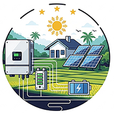

<p align="center">
  
</p>

<h1 align="center">Solar Monitoring Framework</h1>

<p align="center">
  <a href="https://opensource.org/licenses/MIT"></a>
  <a href="https://www.python.org/downloads/"></a>
  <a href="https://github.com/psf/black"></a>
</p>

<p align="center">
A comprehensive, <strong>standalone</strong> monitoring framework for renewable energy systems with <strong>real-time 5-second updates</strong>. Unlike manufacturer apps that update every 15+ minutes and send data to external servers, get instant visibility into your solar system performance while <strong>keeping all data private and local</strong>.
</p>

## 📊 Features & Screenshots

### 🌐 Web Dashboard


_The main web interface showing key metrics and charts (Light and Dark modes)._


### 💻 Console Dashboard

_The text-based console interface for quick monitoring._

### 🏠 Home Assistant Integration

_Example of data displayed in a Home Assistant dashboard via MQTT._

*   **Tuya Smart Plug Automation (Optional):**

_Example graphs showing Tuya plug state and corresponding inverter temperature._

### 🔍 Key Capabilities

-   **🔒 Privacy-First**: All data stays on your local network - no manufacturer servers involved
-   **🧩 Plugin-Based Architecture:** Easily extendable to support new devices by creating new plugins. The framework handles the core logic of polling, data processing, and service integration.
-   **📡 Multi-Device Support:** Concurrently poll multiple devices (e.g., an inverter and a separate BMS) each in its own managed thread.
-   **📊 Data Aggregation:** A central data processor intelligently merges data from all plugins into a unified system view.
-   **🛡️ Intelligent Data Filtering:** Advanced time-based filtering system that automatically detects and prevents sensor errors, unit conversion issues, and communication glitches from corrupting your data.
-   **🌡 Fan Automation:** Local Tuya device control for temperature-based fan automation and other smart home integrations.
-   **🏠 Home Automation Integration:** Optional MQTT integration with Home Assistant, OpenHAB, Domoticz, Node-RED, and other platforms.
-   **🌐 Dynamic Web Dashboard:** A powerful web interface providing a holistic view of your system.
-   **📅 Historical Data Logging:** Records detailed power flow and daily energy summaries to a local SQLite database for advanced analytics and chart generation.
-   **🛡️ System Stability:** A built-in watchdog monitors plugin threads, automatically attempting to re-initialize a failing plugin and triggering a full script restart if necessary.

## 🔌 Available Plugins

| Plugin | Description | Status |
| :--- | :--- | :--- |
| **Inverters** | | |
| `inverter.solis_modbus_plugin` | Ginlong/Solis S6 hybrid inverters (Modbus TCP/Serial) | ✅ Stable |
| `inverter.luxpower_modbus_plugin` | LuxPower hybrid inverters (LXP-5K/12K/LB-5K) | ⚠️ Ready for Testing |
| `inverter.eg4_modbus_plugin` | EG4 hybrid inverters (Modbus TCP/Serial) | ⚠️ Ready for Testing |
| `inverter.growatt_modbus_plugin` | Growatt MIX/SPH hybrid inverters (Modbus TCP/Serial) | ⚠️ Ready for Testing |
| `inverter.srne_modbus_plugin` | SRNE solar charge controllers (Modbus TCP/Serial) | ⚠️ Ready for Testing |
| `inverter.powmr_rs232_plugin` | POWMR hybrid inverters (native inv8851 protocol) | ⚠️ Ready for Testing |
| `inverter.deye_sunsynk` | Deye/Sunsynk hybrid inverters (multiple models) | ⚠️ Ready for Testing |
| **Battery Management** | | |
| `battery.seplos_bms_v2_plugin` | Seplos BMS V2 protocol with cell monitoring | ✅ Stable |
| `battery.seplos_bms_v3_plugin` | Seplos BMS V3 protocol (Modbus) | 🧪 Needs Testers |
| `battery.jk_bms_plugin` | JK BMS devices (Modbus protocol) | 🧪 Needs Testers |

See [CONFIGURATION.md](CONFIGURATION.md) for detailed plugin configuration examples.

## 🚀 Installation & Setup

## Prerequisites

*   📦 **Ready-to-Run Package:** For a quick start on Windows, a pre-packaged version is available on the Releases page.
*   🐍 **Python:** For manual installation, Python 3.9 or newer is **required** (due to use of `zoneinfo`).
*   🔧 **System Libraries (for Optional Console UI):**
    *   **Linux/macOS:** `ncurses` development libraries (e.g., `sudo apt install libncursesw5-dev` on Debian/Ubuntu, `sudo yum install ncurses-devel` on Fedora/CentOS, or `brew install ncurses` on macOS).
    *   **Windows:** Requires the `windows-curses` package (see `requirements.txt`).
*   🔌 **Hardware & Services:**
    *   A solar inverter with Modbus communication enabled (check inverter settings and data logger capabilities).
    *   Optional: A compatible Battery BMS with a serial or TCP connection.
    *   **For Modbus TCP:** A network connection to the device (typically via its WiFi/Ethernet data logger module).
    *   **For Modbus Serial RTU:** An RS485-to-USB adapter connected to the device's RS485 port.
    *   **Optional:** An MQTT Broker for Home Assistant integration (e.g., Mosquitto, EMQX, or the Home Assistant Mosquitto broker add-on).
    *   **Optional:** A Tuya-based Smart Plug for fan control, and its **Device ID** & **Local Key**.
    *   A computer, Raspberry Pi, or similar device to run the script continuously.

```bash
# 1. Clone the repository
git clone https://github.com/jcvsite/solar-monitoring.git
cd solar-monitoring

# 2. Create virtual environment (recommended)
python3 -m venv venv
source venv/bin/activate  # Linux/macOS
# venv\Scripts\activate    # Windows

# 3. Install dependencies
pip install -r requirements.txt

# 4. Create configuration
cp config.ini.example config.ini
# Edit config.ini with your device settings

# 5. Test configuration
python test_plugins/validate_all_plugins.py --offline-only

# 6. Run the application
python main.py
```
Access your dashboard at `http://localhost:8081`

### Connection Methods

- **TCP/IP**: Connect to network-enabled devices or RS232/RS485-to-TCP adapters
- **Serial**: Direct connection via USB-to-Serial adapters
- **Modbus**: Industry-standard protocol supported by many inverters
- **Custom Protocols**: Native protocol implementations for specific devices

## 📋 Documentation

Detailed documentation is organized into separate guides:

- **[CONFIGURATION.md](CONFIGURATION.md)** - Complete configuration options and examples
- **[TESTING.md](TESTING.md)** - Plugin validation and testing tools
- **[DEVELOPER.md](DEVELOPER.md)** - Plugin development and architecture guide

### Plugin Development References

- **[BMS_PLUGIN_DESIGN_REFERENCE.md](BMS_PLUGIN_DESIGN_REFERENCE.md)** - Comprehensive guide for creating BMS plugins
- **[INVERTER_PLUGIN_DESIGN_REFERENCE.md](INVERTER_PLUGIN_DESIGN_REFERENCE.md)** - Detailed reference for inverter plugin development

## 👥 Community & Support

### Getting Help

- **Documentation**: See [CONFIGURATION.md](CONFIGURATION.md), [TESTING.md](TESTING.md), and [DEVELOPER.md](DEVELOPER.md)
- **Issues**: [GitHub Issues](https://github.com/jcvsite/solar-monitoring/issues) for bug reports and feature requests
- **Discussions**: [GitHub Discussions](https://github.com/jcvsite/solar-monitoring/discussions) for questions and community support

❤️ **Support:**

This project was created and is maintained by **JC Villalon** ([@jcvsite](https://github.com/jcvsite)). It's a personal project provided "as is", and while I aim for it to be useful, I cannot guarantee timely support or fixes for all issues.
If you use any information or code from this project, please consider giving credit by linking back to this repository and starring it on GitHub!

*   **Primary Method:** Please **open an Issue** on the GitHub repository for bug reports, questions, or feature requests.
*   **🐛 Bug Reports:** Include:
    *   Your `config.ini` (**SECRETS REMOVED** - e.g., replace passwords with `***`).
    *   Relevant sections from `solar_monitoring.log` (preferably with `LOG_LEVEL = DEBUG`).
    *   A clear description of the problem and steps to reproduce it.
    *   Screenshots if applicable.

*   If you find this project useful, consider showing your appreciation:
    *   [Buy Me a Coffee](https://coff.ee/jcvsite)
    *   [PayPal](https://paypal.me/jcvsite)

🤝 **Contributing:**

Contributions are welcome! 
See [DEVELOPER.md](DEVELOPER.md) for guidelines on creating plugins and contributing to the project.

### License

This project is licensed under the MIT License - see the [LICENSE](LICENSE) file for details.

---

**GitHub**: [https://github.com/jcvsite/solar-monitoring](https://github.com/jcvsite/solar-monitoring)
