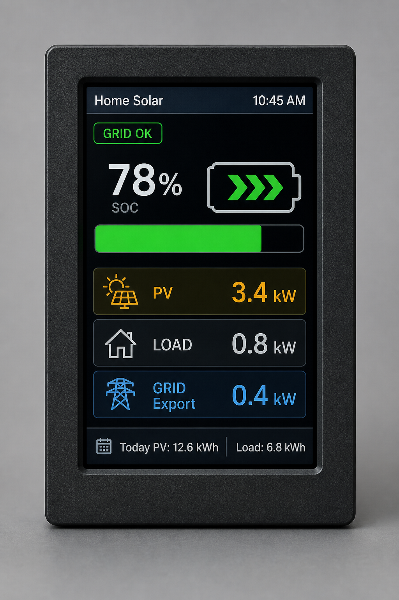

# Solar Monitoring Viewer (ESP32)

> **Firmware home:** [github.com/jcvsite/Solar-monitoring-viewer-esp32](https://github.com/jcvsite/Solar-monitoring-viewer-esp32)  
> This copy in `solar-monitoring/esp32_display/` tracks development; releases and OTA are published from the viewer repo.

Local wall/desk display for **[solar-monitoring](https://github.com/jcvsite/solar-monitoring)**.

<p align="center">
  
</p>

> The photo above is an **early design mockup**. Firmware **v0.3.0+** uses **LVGL** for card-based UI aligned with the web dashboard mockups (themes, layouts, animated SOC/grid alert).

**Actual Glance screen — Classic layout (portrait 240×320, LVGL v0.3.1):**

```text
┌──────────────────────────────┐
│ My Home Solar    ☀ 32°C  3:36 PM │  title + weather + server clock
│ ● GRID OK  (or NO GRID blink)│  grid status chip
│      [battery]    78%        │  centered battery + large white SOC
│        Charging 450 W        │
│ ☀ PV                  3.4 kW │  right-aligned values + caption icons
│ ⌂ LOAD                0.8 kW │
│ ⇄ GRID               120 W   │
│ Today PV 12.6   Load 6.8     │
│  🏠   🔋   📊   ⚙           │  icon-only bottom nav (accent + dot)
└──────────────────────────────┘
```

| | |
|---|---|
| **What it does** | Shows live SOC, PV / load / grid, BMS detail, and a simple history sparkline |
| **How it talks** | HTTP to your solar-monitoring PC (`/api/display`) — no cloud |
| **How you set WiFi** | On-screen touch picker + keyboard, or phone browser fallback (SoftAP) |
| **Hardware** | ESP32-2432S028R **Cheap Yellow Display** (CYD), 2.8″ 240×320 touch |
| **Many boards?** | Yes — each device has a unique setup AP name |

This folder is self-contained and can later become its **own GitHub repository**.

---

## What you need

### Supported hardware

This firmware targets the **ESP32 Cheap Yellow Display (CYD)** — commonly sold as **ESP32-2432S028** / **ESP32-2432S028R** (board label **HW-458**).

| | |
|---|---|
| **Display** | 2.8″ ILI9341 color TFT, **240×320** pixels |
| **Touch** | XPT2046 resistive (separate SPI bus from the LCD) |
| **MCU** | ESP32 (dual-core, typically **4 MB** flash) |
| **USB** | Micro-USB (CH340 or CP2102 serial) |
| **Size** | ~87 × 49 mm PCB |
| **Pin map** | Default `platformio.ini` matches [witnessmenow CYD](https://github.com/witnessmenow/ESP32-Cheap-Yellow-Display) |

Other ILI9341 240×320 ESP32 boards may work if you adjust TFT/touch pins in `platformio.ini` and `include/config.h`.

### Software / network

1. A **CYD ESP32 display** (see above)  
2. A PC or Pi running **solar-monitoring** with the web dashboard on (default port **8081**)  
3. Same WiFi / LAN for both  
4. USB **data** cable for flashing  

On the host (`config.ini`):

```ini
[GENERAL]
SYSTEM_TITLE = My Home Solar
LOCAL_TIMEZONE = Asia/Manila

[WEATHER]
ENABLE_WEATHER_WIDGET = True
WEATHER_DEFAULT_LATITUDE = 16.6167
WEATHER_DEFAULT_LONGITUDE = 120.3166

[WEB_DASHBOARD]
ENABLE_WEB_DASHBOARD = true
WEB_DASHBOARD_PORT = 8081
ENABLE_MDNS = true
MDNS_HOSTNAME = solar-monitoring
```

---

## Flash the firmware (easiest for most people)

<p align="center">
  
</p>

### Browser install (recommended)

This is the normal-user path. No PlatformIO or Arduino IDE is needed on the end-user PC.

1. Get a ready-to-use `webflash` package from the project release or CI artifact.
2. Extract it.
3. In that folder, start a small local web server:

```bash
python -m http.server 8765 --directory webflash
```

4. Open **http://localhost:8765** in **Chrome** or **Edge**.
5. Plug in the display with a USB **data** cable.
6. Click **Install firmware**.
7. Choose the serial port and confirm the install.

After flashing, continue with the on-screen WiFi setup in the next section.

> **For maintainers:** the `webflash` package is produced from the firmware build and can be published in releases. CI under [`.github/workflows/esp32-display-firmware.yml`](../.github/workflows/esp32-display-firmware.yml) uploads a `solar-glance-webflash` artifact.

### Developer upload (fallback)

```bash
pio run -t upload
pio device monitor
```

If upload fails, hold **BOOT**, start upload, release when writing begins.  
Default pins match common CYD 2.8″ boards (`platformio.ini`). Change `build_flags` if your seller’s wiki differs.

---

## First-time WiFi setup

No need to edit `secrets.h` for normal use.

### Option A — On the display (recommended)

Use the built-in touch UI — no phone required.

1. Power the display (USB). If WiFi is not configured, the **WiFi network list** opens automatically.  
2. Wait for **Scanning…** to finish (a few seconds).  
3. **Tap your home network** in the list (signal strength and lock icon shown).  
4. Type the password with the on-screen keyboard:  
   - **ABC / abc** toggles upper/lower case  
   - **Show / Hide** reveals the password  
   - **Del** removes the last character  
   - **space** and symbols `. - _ @` are available  
5. Tap **Connect**. On success the display joins your LAN and continues to host discovery.  

To change WiFi later: **Settings → WiFi Setup**.

### Option B — Phone browser (fallback)

Useful if touch calibration is off or you prefer a full phone keyboard.

<p align="center">
  
</p>

1. From **Settings → WiFi Setup**, tap **Phone** (or wait on the phone portal screen during SoftAP mode).  
2. On your phone, join the open AP named like **`SolarDisplay-Setup-A1B2`**  
   (suffix is unique per board — set up **one device at a time**).  
3. The captive portal should open automatically; if not, browse to **http://192.168.4.1**.  
4. Pick your home WiFi from the dropdown, enter the password (large touch-friendly fields), and **Save**.  
5. The display joins your LAN, then searches for solar-monitoring (**mDNS**, then subnet scan).  

Credentials are stored in flash.

### Settings PIN (optional)

Set a **4-digit PIN** in **Settings → Settings PIN** on the device, in the web dashboard (**Settings → ESP32 display → Settings PIN**), or on the device web UI (`http://<display-ip>/`). When a PIN is set:

- The **Set** tab on the display asks for the PIN before opening settings.
- The **device web UI** shows a PIN gate before the settings form.
- The **host web dashboard** ESP32 section requires **Enter PIN to unlock** before editing or saving.

The same PIN is synced from the host when **Sync from host** is enabled. Tap **OK** with no digits on the device PIN setup screen to turn the PIN off.

Optional: put SSID/password in `include/secrets.h` (from `secrets.h.example`) as a factory fallback.

---

## Using the display

Touch the bottom tabs:

| Tab | What you see |
|-----|----------------|
| **Glance** | Title, **weather + temperature**, **clock in host `LOCAL_TIMEZONE`**, centered battery icon + large **SOC**, animated fill when charging/discharging, PV / Load / Grid with icons, today kWh. **Red “NO GRID” blink** every 5 s when grid is offline |
| **BMS** | Pack stats, temps, cell delta; color-coded cell voltage bars with min/max markers and centered voltage labels |
| **Hist** | PV & load sparkline (compact chart) + today’s energy totals with color icons |
| **Set** | Scrollable panels — host IP, **FIND** (discover), **Manual**, **WiFi Setup**, firmware OTA, settings PIN. Color icons on rows and tabs |

```text
ESP32 display  --HTTP GET /api/display-->  solar-monitoring :8081
               --mDNS _solar-monitoring._tcp--^
```

---

## Multiple displays

Supported. Each board has its own SoftAP name and hostname (from chip ID).  
All can poll the same solar-monitoring host — the APIs are stateless.

---

## Troubleshooting

| Symptom | What to try |
|---------|-------------|
| Upload fails | Hold **BOOT**, retry; check COM port; try a data-capable USB cable |
| Stuck on WiFi Setup | Tap **Rescan**; check 2.4 GHz network; try **Phone** fallback; join exact AP name `SolarDisplay-Setup-XXXX` |
| Wrong WiFi password | Tap network again → re-enter password; use **Show** to verify characters |
| WiFi OK but no data | Confirm host web dashboard is running; Settings → **FIND**; same LAN/VLAN |
| Wrong colors / white screen | Pin map mismatch — check seller wiki vs `platformio.ini` |
| Touch not working | CYD uses a **separate SPI bus** for touch (GPIO 25/32/39/33/36). See [CYD TouchTest](https://github.com/witnessmenow/ESP32-Cheap-Yellow-Display/tree/main/Examples/Basics/2-TouchTest). Tune `TOUCH_MAP_*`, `TOUCH_SWAP_XY`, `TOUCH_MIRROR_X/Y` in `include/config.h` |
| Touch upside down / offset | Adjust `TOUCH_MIRROR_X` / `TOUCH_MIRROR_Y` / `TOUCH_SWAP_XY` in `include/config.h` |

---

## For developers

- **Logo bitmap:** boot splash uses the unmodified **192×192** icon from `static/icons/icon-192x192.png` (RGB565 embed only). Regenerate with:
  `python esp32_display/scripts/png_to_logo_header.py`
- APIs: `GET /api/display`, `/api/display/bms`, `/api/display/history?hours=24`  
  Glance payload includes `clock`, `timezone`, `tz_offset_sec`, and `weather` (Open-Meteo, cached on the host).  
  The display uses the host timezone for NTP and shows the server `clock` string in the header.
- Discovery: mDNS service `_solar-monitoring._tcp` (TXT includes `api_version`, paths)  
- Stack: PlatformIO, **LVGL 8.x**, TFT_eSPI (display flush), ArduinoJson, WiFiManager, XPT2046  

**Split to its own repo:** copy this folder; keep the HTTP + mDNS contract documented — no Python code is required in that repo.

Home Assistant auto-discovery via the same mDNS TXT is planned as a **separate** custom-component project.
